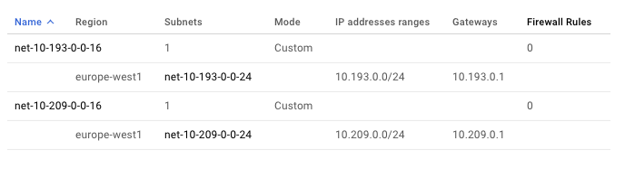
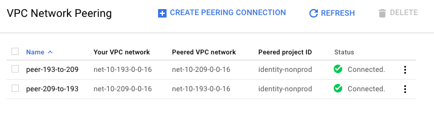
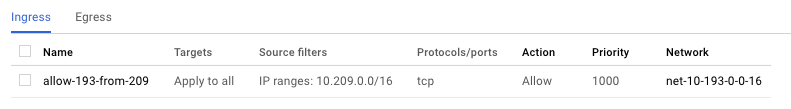
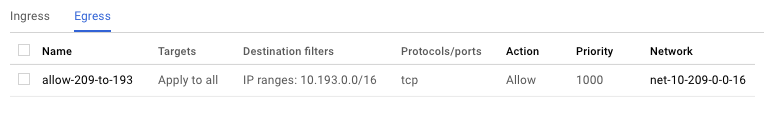
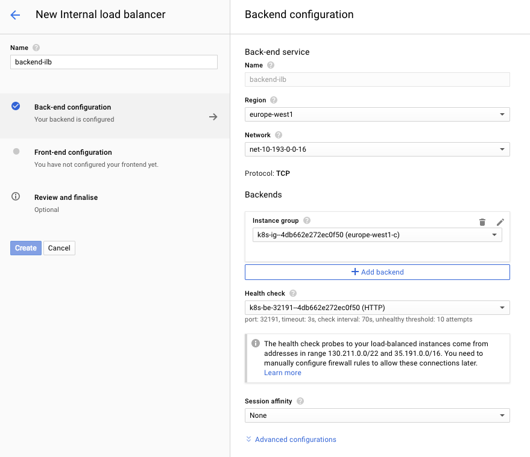
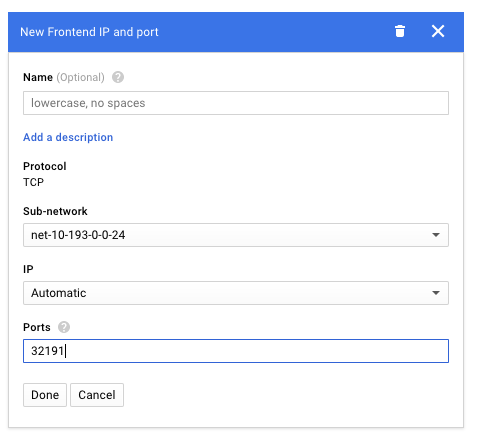

# Getting k8s in peered Google cloud VPCs to talk to each other

(when your VPCs are in the `10.0.0.0/8` range)

## Problem statement

You have two VPCs, let's call them VPC A and VPC B. You have set up a peering connection between the VPCs.

You have a backend service running in a GKE k8s cluster in VPC A, and a frontend service running in a GKE k8s cluster in VPC B.

The frontend service needs to make requests to the backend service.

You want to make these requests via the VPC peering connection, not via the public internet.

To avoid coupling the frontend to the details of the backend's k8s cluster, you want to access the backend service via an internal load balancer, not connect directly to the k8s cluster's instances.

## Create the VPCs

I'm using the following IP ranges for my VPCs, which were assigned to me in the sacred network planning spreadsheet. Your IP ranges will be different.

```
VPC A = 10.193.0.0/16 (the backend will live here)
VPC B = 10.209.0.0/16 (the frontend will live here)
```



## Peer the VPCs

Create 2 peering connections to peer the VPCs together.



## Create firewall rules

We need firewall rules to allow traffic between the VPCs.

For simplicity I'm allowing all TCP traffic to all instances, but you should restrict access to only the ports and instance tags you need.

You need an egress rule allowing the frontend service's VPC to make requests to the backend service's VPC, and an ingress rule telling the backend service's VPC to accept those connections.





## Create the k8s clusters

Create one Container Engine cluster in each VPC.

Leave everything as default except:

* I changed the k8s version from the default (1.6.8) to the latest available (1.7.3)
* I reduced the cluster size to 1 instance to save a bit of money

## Deploy the backend service

I'm using a simple nginx container to act as a dummy backend.

### Build and publish the docker image

```
$ cd backend
$ docker build -t gcr.io/<google project name>/dummy-backend .
$ gcloud docker -- push gcr.io/<google project name>/dummy-backend:latest
```

You'll need to edit `k8s/deployment/deployment.yaml` to point to wherever you pushed the image.

### Create the deployment

```
$ gcloud container clusters get-credentials backend-cluster
Fetching cluster endpoint and auth data.
kubeconfig entry generated for backend-cluster.

$ kubectl apply -f k8s/backend/deployment.yaml
deployment "backend" created
```

## Create an internal load balancer for the backend

Depending on your circumstances, this is either very simple or quite complicated.

### The easy version

* If you are using the default VPC and subnet (unlike in my example), it should be very simple to create a k8s service with an ILB.

   ```
   $ kubectl apply -f k8s/backend/service-with-ilb.yaml
   ```

* If you are using a custom VPC, and you can wait until k8s 1.7.4 is available on GKE, you should be able to do the same. ([source](https://github.com/kubernetes/kubernetes/issues/33483#issuecomment-322240845))

### The hard version

The workaround I found goes as follows:

1. Create a k8s service with a NodePort
2. Create a k8s ingress. This creates an external load balancer, which we don't care about
3. Manually create an ILB, connected to the resources that were created by the ingress.

#### Create a service with a NodePort

```
$ kubectl apply -f k8s/backend/service.yaml
service "dummy-backend" created
```

#### Create an ingress

```
$ kubectl apply -f k8s/backend/service.yaml
service "dummy-backend" created
```

This will create a load balancer, a backend for that load balancer, and a healthcheck. The backend and healthcheck will point at the service's NodePort.

At first the UI will complain that the backend of the ingress is "UNHEALTHY", but after a few minutes this should fix itself. You can check that everything is working by hitting the load balancer's external IP:

```
$ curl 35.201.122.31
<h1>Hello Kubernetes!</h1>
```

#### Create an internal load balancer (ILB)

This bit needs to be done manually.

Network Services > Load balancing > Create load balancer > TCP load balancing > "Only between my VMs"

For the ILB's backend, choose the instance group and health check that were created by the ingress:



For the frontend config, the port must be the port that was automatically selected for the service's NodePort:



You can check it's working by SSHing into your k8s cluster instance and making a request to the ILB:

```
chris@gke-backend-cluster-default-pool-25a13d18-fkw6 ~ $ curl 10.193.0.3:32191
<h1>Hello Kubernetes!</h1>
```

## Get the frontend to talk to the backend

For the frontend, I won't bother creating a deployment. I'll just run `curl` on a k8s to simulate the frontend service.

First let's switch to the cluster running in the frontend VPC:

```
$ gcloud container clusters get-credentials frontend-cluster
Fetching cluster endpoint and auth data.
kubeconfig entry generated for frontend-cluster.
```

Now start and attach to a container that has the `curl` command available:

```
$ kubectl run -i -t --image ellerbrock/alpine-bash-curl-ssl curl --command bash --limits "cpu=10m,memory=128Mi"
If you don't see a command prompt, try pressing enter.
bash-4.3$
```

Let's see if we can access the ILB we just created in the other VPC:

```
bash-4.3$ curl 10.193.0.3:32191
(... hangs forever ...)
```

We can see why it's hanging if we SSH into the k8s instance in the frontend cluster and run `tcpdump` while we run the `curl` command:

```
$ gcloud compute --project "identity-nonprod" ssh --zone "europe-west1-c" "gke-frontend-cluster-default-pool-d65237bb-1c6s"
...
...
chris@gke-frontend-cluster-default-pool-d65237bb-1c6s ~ $ toolbox apt-get update
...
...
chris@gke-frontend-cluster-default-pool-d65237bb-1c6s ~ $ toolbox apt-get install tcpdump
...
...
chris@gke-frontend-cluster-default-pool-d65237bb-1c6s ~ $ toolbox tcpdump net 10.193.0.0/16
Spawning container chris-gcr.io_google-containers_toolbox-20161110-02 on /var/lib/toolbox/chris-gcr.io_google-containers_toolbox-20161110-02.
Press ^] three times within 1s to kill container.
tcpdump: verbose output suppressed, use -v or -vv for full protocol decode
listening on eth0, link-type EN10MB (Ethernet), capture size 262144 bytes
14:11:16.397959 IP 10.132.0.10.47162 > 10.193.0.3.32191: Flags [S], seq 128996406, win 28400, options [mss 1420,sackOK,TS val 6273400 ecr 0,nop,wscale 7], length 0
14:11:17.399642 IP 10.132.0.10.47162 > 10.193.0.3.32191: Flags [S], seq 128996406, win 28400, options [mss 1420,sackOK,TS val 6274402 ecr 0,nop,wscale 7], length 0
14:11:19.405619 IP 10.132.0.10.47162 > 10.193.0.3.32191: Flags [S], seq 128996406, win 28400, options [mss 1420,sackOK,TS val 6276408 ecr 0,nop,wscale 7], length 0
```

You can see that the container is using its cluster-internal IP address (`10.132.0.10`) to make its requests. This won't work when trying to talk to the other VPC, as the router for the VPC peering connection will drop any packets from this address that it doesn't understand.

However, if you run `curl google.com` inside the container, it works fine. So what's going on?

The reason is that when the container sends a request to `google.com`, an `iptables` rule is applied by the host k8s instance. This rule "masquerades" the traffic, replacing the source IP address with that of the host instance (`10.209.0.2`). This is an address in the VPC's CIDR block, so the internet gateway understands how to route the traffic.

Here is the masqurade rule in iptables:

```
chris@gke-frontend-cluster-default-pool-d65237bb-1c6s ~ $ sudo iptables-save | grep "SNAT for outbound"
-A POSTROUTING ! -d 10.0.0.0/8 -m comment --comment "kubenet: SNAT for outbound traffic from cluster" -m addrtype ! --dst-type LOCAL -j MASQUERADE
```

This rule applies the masquerade to any traffic whose destination does NOT match `10.0.0.0/8`. Unfortunately the load balancer we are trying to access is in the VPC with IP range `10.193.0.0/16`, so the rule is not applied.

The problem is that k8s assumes all addresses inside `10.0.0.0/8` are cluster-internal addresses, but for us this is not the case because our VPCs also have their CIDR blocks inside that range.

We need to add another masquerade rule for the other VPC's CIDR block.

Here's the line to add:

```
-A POSTROUTING -d 10.193.0.0/16 -m comment --comment "chris: SNAT for outbound traffic to backend VPC" -m addrtype ! --dst-type LOCAL -j MASQUERADE
```

and here's how to add it:

```
ris@gke-frontend-cluster-default-pool-d65237bb-1c6s ~ $ sudo iptables-save > /tmp/iptables.txt
chris@gke-frontend-cluster-default-pool-d65237bb-1c6s ~ $ vim /tmp/iptables.txt
<add the new rule just below the existing masquerade rule>
chris@gke-frontend-cluster-default-pool-d65237bb-1c6s ~ $ sudo iptables-restore < /tmp/iptables.txt
```

Now if you try the curl command in the container again, it works!

```
bash-4.3$ curl 10.193.0.3:32191
<h1>Hello Kubernetes!</h1>
```

### Aside: IP aliases

This iptables kludgery is apparently unnecessary if you use the new IP aliasing feature of GKE (currently in beta), but that feature is pretty much undocumented. I couldn't find any way to turn it on. It seems to require setting an environment variable in the k8s master, but I don't think that's possible with GKE.

## Automate the addition of the iptables rule

All that remains is to automate the work we just did to add the iptables rule, so we can do it easily on all cluster instances.

We can do this with a k8s daemonset.

```
$ kubectl apply -f k8s/frontend/app-iptables-rule.yaml
```

This will run a script whenever any instance in the cluster starts up, which will add the necessary iptables rule.

## Known issues/future work

Internal load balancers don't work with VPNs, so we need to find another solution to let services in AWS talk to services in GCP.
